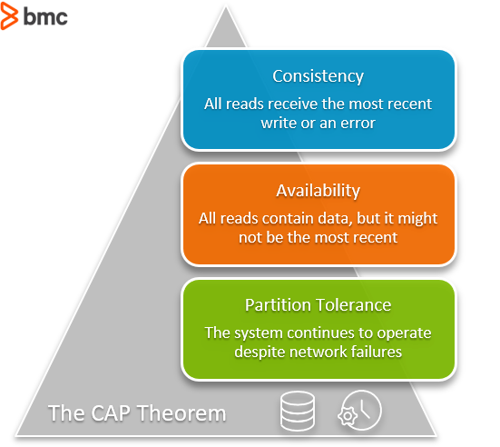

# Operational Data Storage

## Status
Accepted

## Context

With the growth of Microservices, Cloud, Distributed Applications, Global Scaling, and Semi-Structured Data, it is more vital than ever to select a database since it affects the entire performance and cost of the system.

### Alternatives

- RDBMS
- NoSQL

### PrOACT

| Criteria                       | RDBMS  | NoSQL |
| ------------------------------ | ------ | ----- |
| Schema Flexibility             | Low    | High  |
| Scalability                    | Medium | High  |
| Availability                   | Medium | High  |
| Data Consistency               | High   | Low   |
| Write Performance Requirements | Low    | High  |
| Cost                           | High   | Low   |

credits : https://www.researchgate.net/figure/CAP-theorem-with-databases-that-choose-CA-CP-and-AP_fig1_282519669

credits : https://www.researchgate.net/figure/CAP-theorem-with-databases-that-choose-CA-CP-and-AP_fig1_282519669

## Decision

- NoSQL over RDBMS since scalability is desired. 
- Schema flexibility for a green field project is important due to ambiguity and the evolution of the system in the initial phases.

## Reference

- https://www.bmc.com/blogs/cap-theorem/#:~:text=The%20CAP%20theorem%20is%20a,or%20availability%E2%80%94but%20not%20both
