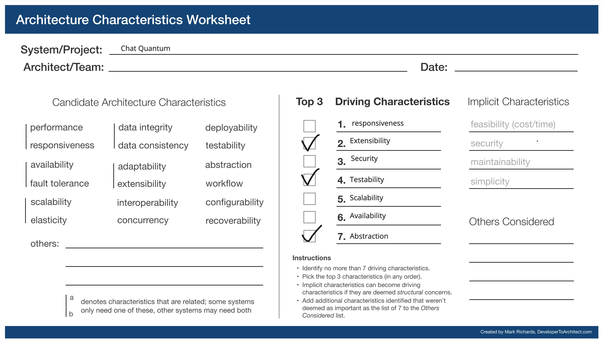
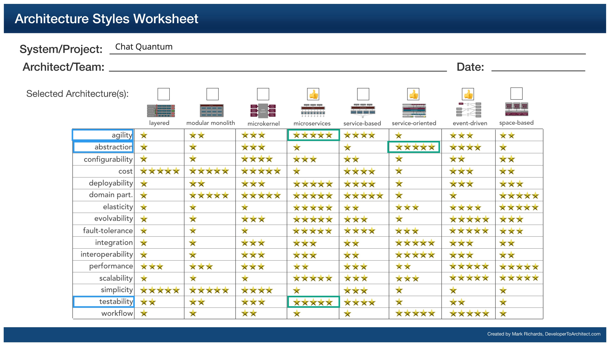

## Chat

### Context

Having in-app chat support on the platform is a great way to engage with the community. Also, a candidate doesn't have to leave the app to engage with the mentors (say, over email).

However, building an in-house chat solution 

### Responsibilities

1. Initiate a new conversation with users.
2. View and reply to messages.
3. Support read receipts and last active status.
4. Integrate with 3rd party chat service for the functionalities.
5. [Long Term] Remind users through an email if a chat remains unread.

### Driving Architectural Characteristics

#### Top 3

##### Driving Architectural Characteristics
* **Responsiveness** - The messages have to be sent and received with minimal latency
* **Data integrity** - Correctness of messages and intended recipients.
* **Adaptability** - The chat service acts like a facade to the 3rd party chat provider.

##### Characteristics that we do not need as we offloaded to 3rd party vendors
* **Security** - Security for messages during storage and transit.
* **Scalability** - Service highly depends on third party service for scale
* **Availability** - Service highly depends on third party service for uptime

### Architectural Style Preferred

Microservices

### Tradeoffs - Mitigation Strategies
* Building a highly responsive chat service within the platform is a challenge and time consuming. Also, it is not the core value proposition of the platform. So, go for an external chat provider
